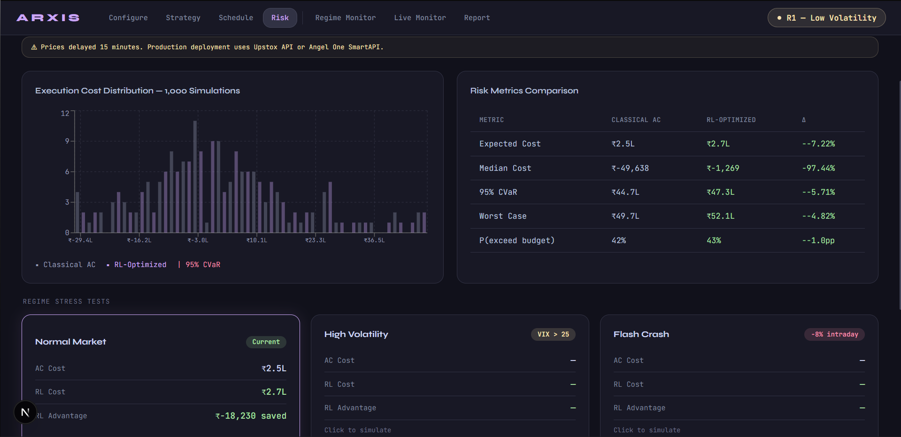

# ARXIS 
**Adaptive Regime-aware eXecution Intelligence System**

A full-stack institutional execution analytics platform for NSE-listed equities that solves the optimal execution problem to minimize the total cost of large block sales.

 ## 🚀 The Elevator Pitch
Selling a massive block of shares (e.g., 500,000 shares of Reliance) without crashing the price is difficult. ARXIS solves the "optimal execution problem" by minimizing three costs:
1. **Market Impact:** Your own selling pushing the price down.
2. **Timing Risk:** The market moving against you while you wait to sell.
3. **Tail Losses:** Rare, extreme scenarios like market crashes or circuit breakers.

Built for portfolio managers, quant analysts, and execution desks, ARXIS uses a pipeline of mathematical and machine learning models to generate SEBI-compliant trading schedules optimized for the National Stock Exchange of India (NSE).

## 🧠 The Quantitative Engine
ARXIS does not rely on simple TWAP or VWAP algorithms. It combines three advanced frameworks:

1. **HMM (Regime Classifier):** A 4-state Gaussian Hidden Markov Model trained on 2 years of daily OHLCV data to detect hidden market regimes (Bull, Bear, Mean-Reverting, Crisis) in real-time.
2. **QR-DQN (The Optimizer):** A Distributional Reinforcement Learning agent (Quantile Regression DQN) that explicitly minimizes Conditional Value at Risk (CVaR) rather than just expected cost, preventing catastrophic tail losses.
3. **Almgren-Chriss (The Benchmark):** A closed-form mathematical baseline calibrated to live liquidity data, providing a transparent comparison to prove the RL agent's savings.

## ⚡ Features
* **Live Calibration:** Fetches fresh market data (yfinance), retrains the HMM, and calibrates impact parameters dynamically on every request.
* **Monte Carlo Risk Analysis:** Simulates 100-250 price paths using Geometric Brownian Motion to stress-test the strategy against Normal, High Volatility (VIX > 25), and Flash Crash scenarios.
* **Slippage Attribution:** Breaks down execution costs into Permanent Impact, Temporary Impact, Timing Risk, and Regime-forced delays.
* **SEBI Compliance:** Formats the execution schedule as a pre-approved trading plan compliant with SEBI (Prohibition of Insider Trading) Regulations 2015.
* **Optimistic UI:** Next.js frontend features smooth Framer Motion animations, Recharts data visualization, and a local fallback state for seamless demonstrations even if the backend is offline.

## 🛠️ Tech Stack

**Backend (The Brains)**
* **Python 3.11+**
* **FastAPI & Uvicorn** (Async REST API)
* **Pydantic v2** (Data validation)
* **Quant Libs:** `numpy`, `pandas`, `scipy`, `hmmlearn`
* **ML/RL:** `PyTorch`, `stable-baselines3`, `sb3-contrib`, `gymnasium`

**Frontend (The Face)**
* **Next.js 15** (App Router, Server/Client components)
* **TypeScript** (Strict mode)
* **Tailwind CSS & Framer Motion** (Styling and animation)
* **Zustand** (Global state management)
* **Recharts** (Interactive charting)

**DevOps & CI/CD**
* **GitHub Actions** (Automated Pytest pipeline)
* **Railway** (PaaS Deployment)

---

## 💻 Local Development Setup

### 1. Clone the repository
```bash
git clone [https://github.com/YOUR_USERNAME/ARXIS.git](https://github.com/YOUR_USERNAME/ARXIS.git)
cd ARXIS

2. Backend Setup
cd backend

# Create and activate a virtual environment
python -m venv venv
source venv/bin/activate  # On Windows: venv\Scripts\activate

# Install dependencies
pip install -r requirements.txt

# Run the FastAPI server
uvicorn main:app --reload --port 8000


3. Frontend Setup
Open a new terminal window
cd frontend

# Install dependencies
npm install

# Create environment file
echo "BACKEND_URL=[http://127.0.0.1:8000](http://127.0.0.1:8000)" > .env.local

# Run the Next.js development server
npm run dev


Testing (CI/CD)
This project uses GitHub Actions to automatically run backend tests before deployment. To run tests locally:
cd backend
pytest test_main.py -v

API Endpoints Overview
GET /api/v1/stocks/search?q={query} - Debounced NSE ticker search

GET /api/v1/stocks/{ticker}/profile - Live stock profile & circuit limits

POST /api/v1/execution/generate - Runs the HMM -> RL -> AC pipeline

POST /api/v1/execution/{id}/simulate - Runs Monte Carlo stress tests

Disclaimer
This platform is a portfolio piece and technological demonstration. It uses delayed data from Yahoo Finance. Do not use this tool for actual live trading. For production deployment, the data layer must be swapped to an institutional feed like Upstox API or Angel One SmartAPI.